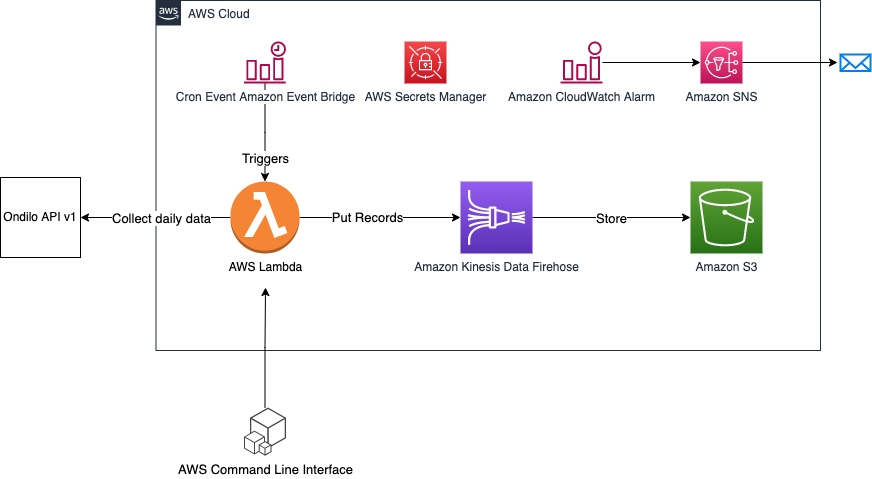

# Ondilo ICO to Amazon S3

This project deploys an infrastructure on AWS to collect and store data from the Ondilo ICO API v1.

Ondilo ICO is a device to easily connect swimming pools and Spas. The device collect various data (temperature, ph, ...) and store them in the Ondilo Cloud.



The project deploys an AWS Lambda function that collect data on the Ondilo Api. To connect to the API, the function uses a token stored in Secrets Manager.
The json records are then pushed to an Amazon Kinesis Data Firehose delivery stream that stores the data on an Amazon S3 bucket.
An Event bridge event is scheduled to trigger the Lambda function everyday.

The data is partitioned with the following scheme: deviceId/year/month/day/

By default, the Lambda function collect the previous day records but there is an option to retrieve the previous month records that can be triggered using AWS CLI. 

IMPORTANT: By default, the project will create a S3 bucket to store your records but there is an option if you prefer to reuse your existing datalake.

## Application Deployment

### pre requisite
To deploy this project, you need an AWS account. You also need the AWS cli and CDK cli installed and configured on your development environment.

### deployment

To manually create a virtualenv on MacOS and Linux:

```
$ python3 -m venv .venv
```

After the init process completes and the virtualenv is created, you can use the following
step to activate your virtualenv.

```
$ source .venv/bin/activate
```

If you are a Windows platform, you would activate the virtualenv like this:

```
% .venv\Scripts\activate.bat
```

Once the virtualenv is activated, you can install the required dependencies.

```
$ pip install -r requirements.txt
```

Important: You need to install the dependencies for the lambda function,

```
$ cd ondilo_to_s3/OndiloToS3LambdaFunction/
$ pip install -r requirements.txt -t python-libs
$ cd ../../
```

At this point you can now synthesize the CloudFormation template for this code.

If you want everything to be created, run the following command:
```
$ cdk deploy
```

If you want to collect the Ondilo ICO data in an existing S3 bucket, run the following method:
```
$ cdk deploy --context s3bucketname=S3_BUCKET_NAME
```

Then run the initializeToken.py script and follow the instructions to collect your authentication token.
Copy the authentication token in the secret created by the stack in secrets manager.

Optionnal: if you want to collect your historical data (limited to 30 days), execute the lambda invoke command:

```
aws lambda invoke --function-name FUNCTION_ARN --payload '{ "month": "true" }' --cli-binary-format raw-in-base64-out result.txt
```

## Additional informations

This project makes use of the Ondilo python library: https://github.com/JeromeHXP/ondilo

The Ondilo API v1: https://interop.ondilo.com/docs/api/customer/v1/

If you like this project, stars it to encourage new enhancements!